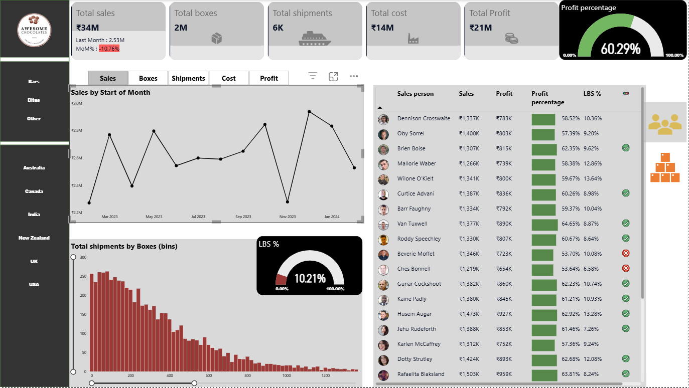

# 📊 Sales Data Dashboard (Power BI)

## 🔹 Overview
This project is an interactive **Sales Dashboard** built using Power BI to analyze and visualize sales performance across different regions, products, and time periods.

The dashboard provides actionable insights into sales trends, product performance, and regional distribution using dynamic visualizations.

---

## 🔹 Dataset Description
The dataset includes:

- Sales Person  
- Geography (Country)  
- Product  
- Date  
- Sales Amount  
- Boxes Sold  

Additional supporting tables:
- Product Category & Cost per Box  
- Geographic Regions (APAC, Europe, Americas)  
- Date table for time-based analysis  

---

## 🔹 Features & Functionality

- 📌 **Interactive Slicers**
  - Filter by product, region, and date
- 📊 **Dynamic Visualizations**
  - Sales trends over time  
  - Product-wise performance  
  - Region-wise distribution  
- 🔁 **Bookmarks**
  - Smooth navigation between dashboard views  
- 🧮 **DAX Calculations**
  - Custom measures for KPIs and aggregations  
- 🎯 **KPI Indicators**
  - Total Sales  
  - Total Boxes Sold  
  - Performance insights  

---

## 🔹 Tools & Technologies

- Power BI  
- DAX (Data Analysis Expressions)  
- Excel (Data Source)  

---

## 🔹 Screenshots

### 📸 Dashboard Overview

---

## 🔹 How to Use

1. Download the `.pbix` file from this repository  
2. Open it using Power BI Desktop  
3. Use slicers and filters to explore the dashboard  

---

## 🔹 Author

Devansh Jadhav
